# FDA  Submission

**Your Name:** Chris DAEMS

**Name of your Device:** Pneumonia Detection Assistant

## Algorithm Description 

### 1. General Information

**Intended Use Statement:** The intended use is to assist radiologist detect pneumonia by examaning x-ray images.

**Indications for Use:** The algorithm screens x-ray images of patients up to 120 Years. The patients can be both male or female and the results are balanced out well. The images must be of an x-ray type and the body part must be CHEST. As it images must be x-ray therefore the modality must be equal to 'DX' and the body postion must be 'AP' or ' PA'

**Device Limitations:** Running the algorithm requires a GPU and therefore it's not suitable in an emergency setting. 

**Clinical Impact of Performance:** Precision is: 49%, Recall is: 80.0%, F1 Score is: 61%, and Accuracy is: 73%. 
Although we see that the recall value is high and therefore the false positive rate might also be high, it still is a good assistent for the radiologist. 

### 2. Algorithm Design and Function

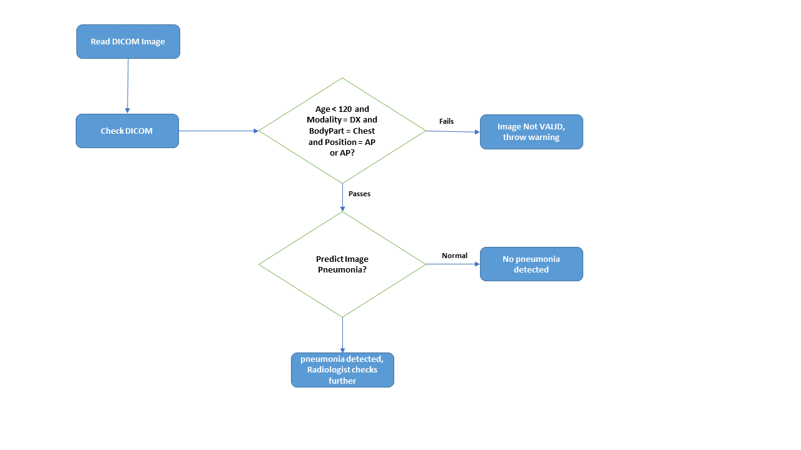

**DICOM Checking Steps:**
* Patient Age < 120
* Patient examined body part = 'CHEST'
* Patient Position = 'PA' - Post Anteriot or 'AP' - Anterior Post
* Image modality = 'DX'

**Preprocessing Steps:** Read the image and resize to (224, 224)

**CNN Architecture:** The CNN base network is VGG16 pre-trained on imagenet (https://keras.io/api/applications/vgg/#vgg16-function)

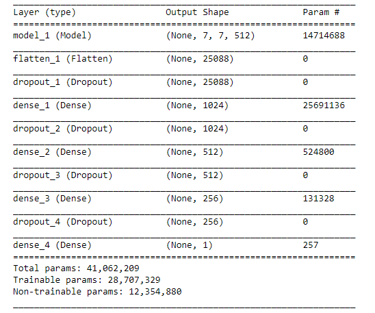

### 3. Algorithm Training

**Parameters:**
* Types of augmentation used during training:
    * horizontal_flip = True 
    * vertical_flip = False 
    * height_shift_range = 0.1 (10% max)
    * width_shift_range =0.1 (10% max)
    * rotation_range =10 (degrees)
    * shear_range = 0.1 (10% max)
    * zoom_range=0.1 (10% max)
    
    
* Batch size: Training batch size = 32

* Optimizer learning rate: Adam(lr=1e-3), I also retrained using Adam(lr=1e-4) and Adam(lr=1e-6)

* Layers of pre-existing architecture that were frozen: 17 layers were frozen

* Layers of pre-existing architecture that were fine-tuned: block5_pool

* Layers added to pre-existing architecture
    * Flatten()
    * Dropout(0.5)
    * Dense(1024, activation='relu')
    * Dropout(0.5)
    * Dense(512, activation='relu')
    * Dropout(0.5)
    * Dense(256, activation='relu')
    * Dropout(0.5)
    * Dense(1, activation='sigmoid')

**Adam(lr=1e-3)**
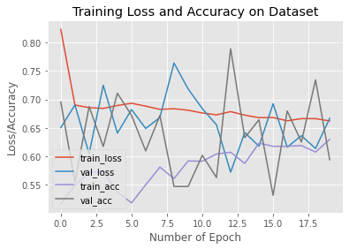
The Training loss and acuracy doesn't seem to be very stable.

Now we train the model with a slower training rate to see if it improves the model.

**Adam(lr=1e-4)**
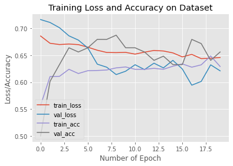

**Adam(lr=1e-6)**
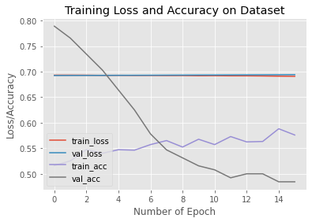
Using Adam(lr=1e-4) did not improve the validation loss and neither did Adam(lr=1e-6)
But it seems that the training loss and validation loss ended up at the same level, while the validation accuracy really dropped after some epochs.  

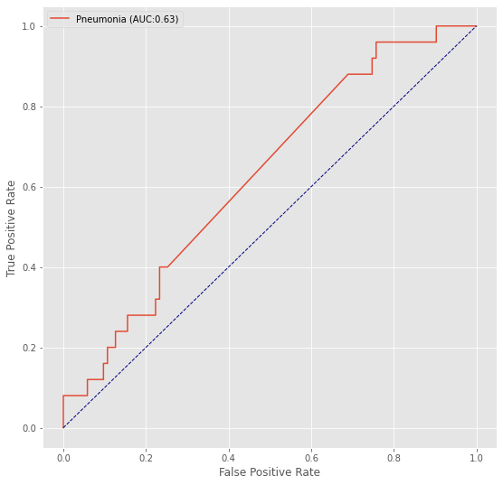

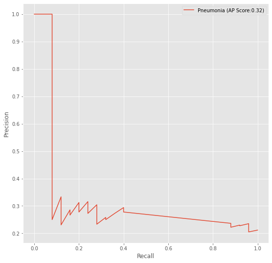

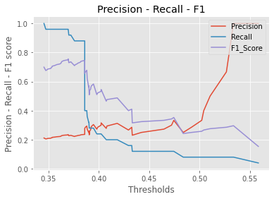

**Final Threshold and Explanation:**
As first you see the F1 score
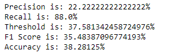

The next image show the confusion matrix where we can clearly see the TP, TN, FP and FN values
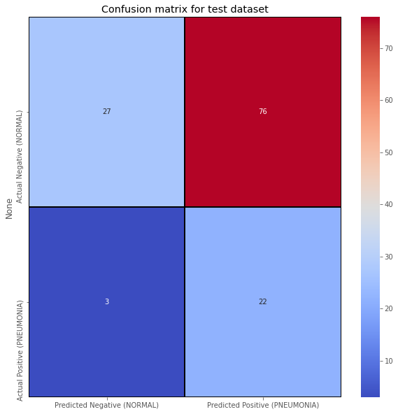

As a summary the model performs as follows:
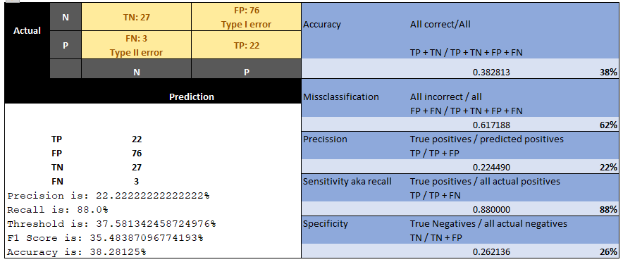

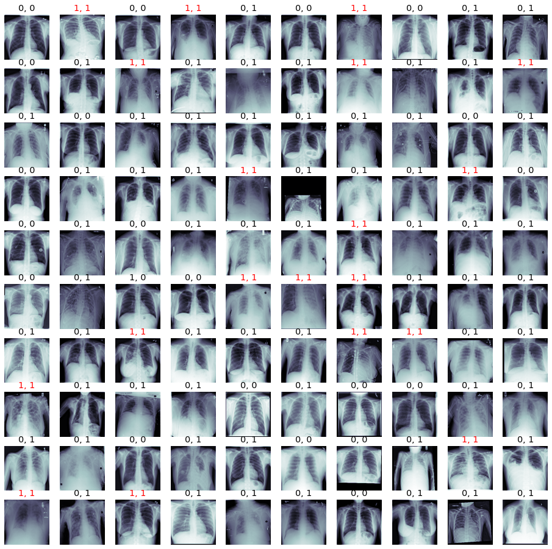

### 4. Databases
The data set labels didn't only included Pneumonia, moreover the percentage of pnemonia is rather small
* Atelectasis           0.103095
* Cardiomegaly          0.024759
* Consolidation         0.041625
* Edema                 0.020540
* Effusion              0.118775
* Emphysema             0.022440
* Fibrosis              0.015037
* Hernia                0.002025
* Infiltration          0.177435
* Mass                  0.051570
* No Finding            0.538361
* Nodule                0.056466
* Pleural_Thickening    0.030191
* **Pneumonia             0.012763**
* Pneumothorax          0.047289

The balance between Male and Female with pneumonia is fairly balanced
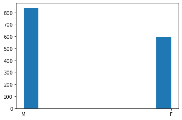

There were some outliers in the ages of the patients, but skipping the outliers the ages are as follows. 
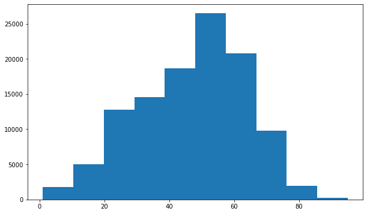

and the ages of patients with only pneumonia
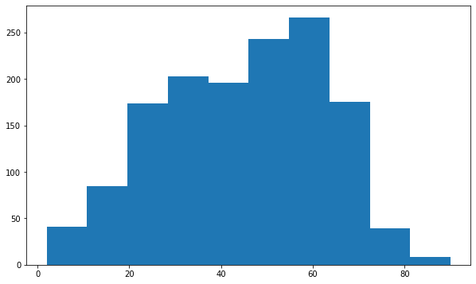

The following graph also shows that there are other labels then only pneumonia
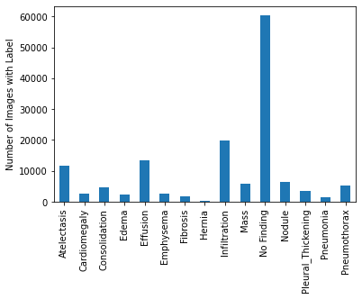

The following graph shows the most prevalent combinations wih pneumonia
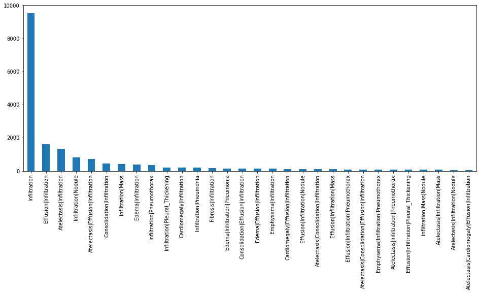

**Description of Training Dataset:** 
The NIH dataset was not specifically acquired for pneumonia. So, while this is a representation of 'pneumonia in the wild,' the prevalence of pneumonia may be different if you were to take only chest x-rays that were acquired in an ER setting with suspicion of pneumonia. But nevertheless, the dataset contained 112120 scans where we found 2290 validated chest x-ray images. 

**Description of Validation Dataset:** 
Same as the training dataset but here we found 1430 validated x-ray images.

### 5. Ground Truth
source: https://www.kaggle.com/nih-chest-xrays/data
The image labels are NLP extracted so there could be some erroneous labels but the NLP labeling accuracy is estimated to be >90%. Therefore the ground truth must go hand in hand with the radiologist. Also the labels indicated that in some cases the patients had more then one disease.  

### 6. FDA Validation Plan

**Patient Population Description for FDA Validation Dataset:**
Gender can be both men and women and the sample must be bakanced. Age is until 120 years, with chest x-ray taken to examen thoracic pathologies.  

**Ground Truth Acquisition Methodology:**
we can use several radiologist identifying Pneumonia. (Silver standard)

**Algorithm Performance Standard:**
The accurary is 38%, while the F1 is around 35%. So it seems not so easy to come up with a good model and the training parameters requires lots of testing which resolve in lots of trial and error. I retrained the model many times and the training rate is definitely an important parameter. 
    * Precision is: 22%
    * Recall is: 88%
    * Threshold is: 38%
    * F1 Score is: 35%
    * Accuracy is: 38%

